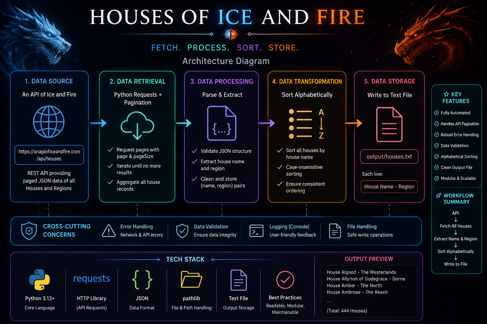

# 🐉 Houses of Ice and Fire

> A clean, production-style Python API integration project that
> retrieves, validates, processes, sorts, and exports all Houses of
> Westeros and Essos.



------------------------------------------------------------------------

## 📌 Assignment

### Coding and Scenario Based Problem

Build a Python application using the **An API of Ice and Fire** API to:

1.  Create a list of **all houses and their regions** from the API.
2.  Write the processed list into a **text file**.
3.  Order all houses **alphabetically**.

### API Endpoint

``` text
https://anapioficeandfire.com/api/houses
```

------------------------------------------------------------------------

## ✨ Project Highlights

-   🌐 REST API integration using `requests`
-   📚 Retrieves **all available houses**, not only the first API page
-   📄 Explicit API pagination with a page size of 100
-   🛡️ Response and record validation
-   🔤 Case-insensitive alphabetical sorting
-   📝 Human-readable text output
-   ⚠️ Exception handling for API/network/data failures
-   🧩 Clean separation of retrieval, validation, processing, and output
-   📁 Professional project structure
-   🔒 Virtual environment excluded from Git
-   📖 Complete documentation and architecture overview

------------------------------------------------------------------------

## 🏗️ Architecture

The application follows a simple data-processing pipeline:

``` text
                 ┌──────────────────────────┐
                 │   An API of Ice and Fire │
                 │        REST API          │
                 └────────────┬─────────────┘
                              │
                              │ HTTP GET
                              ▼
                 ┌──────────────────────────┐
                 │      API Fetch Layer     │
                 │  Pagination + Timeouts   │
                 └────────────┬─────────────┘
                              │
                              ▼
                 ┌──────────────────────────┐
                 │     Validation Layer     │
                 │ Response + Data Checks   │
                 └────────────┬─────────────┘
                              │
                              ▼
                 ┌──────────────────────────┐
                 │    Processing Layer      │
                 │ Name + Region Extraction │
                 │   Alphabetical Sorting   │
                 └────────────┬─────────────┘
                              │
                              ▼
                 ┌──────────────────────────┐
                 │      Output Layer        │
                 │       houses.txt         │
                 └──────────────────────────┘
```

The graphical architecture diagram is included at the top of this
README.

------------------------------------------------------------------------

## 🔄 Application Workflow

### 1. Start Application

Run the Python program from the project root.

### 2. Fetch API Data

The application sends HTTP `GET` requests to:

``` text
https://anapioficeandfire.com/api/houses
```

### 3. Handle Pagination

The API is paginated. The application uses:

``` python
page_size = 100
```

and continues requesting pages until no more records are returned.

Conceptually:

``` text
Page 1 → Page 2 → Page 3 → ... → Empty response → Stop
```

This ensures the program does not accidentally process only the first 10
or 100 houses.

### 4. Validate Data

The application checks that:

-   The HTTP request succeeds.
-   The response contains valid JSON.
-   The response is a list.
-   House records have the expected structure.
-   Required fields such as `name` and `region` are available.

### 5. Extract Required Data

Only assignment-relevant information is retained:

``` text
House Name
Region
```

### 6. Sort

All valid records are sorted alphabetically by house name.

### 7. Generate Output

The result is written to:

``` text
output/houses.txt
```

### 8. Report Completion

The program prints a concise execution summary.

------------------------------------------------------------------------

## 📂 Project Structure

``` text
houses-of-ice-and-fire/
│
├── src/
│   └── houses.py
│
├── output/
│   └── houses.txt
│
├── screenshots/
│   ├── 01_program_execution.png
│   ├── final_program_execution.png
│   └── image.png
│
├── Architecture_dmg.png
├── README.md
├── requirements.txt
├── .gitignore
│
└── venv/
    └── Local virtual environment - not committed to Git
```

  File / Directory         Purpose
  ------------------------ -------------------------------------------------
  `src/houses.py`          Main Python application
  `output/houses.txt`      Generated sorted house and region data
  `screenshots/`           Execution/output screenshots
  `Architecture_dmg.png`   System architecture diagram
  `requirements.txt`       Python dependency list
  `.gitignore`             Prevents unnecessary files from being committed
  `README.md`              Project documentation
  `venv/`                  Local virtual environment

------------------------------------------------------------------------

## 🛠️ Tech Stack

  -----------------------------------------------------------------------
  Technology                          Purpose
  ----------------------------------- -----------------------------------
  **Python 3.x**                      Core application development

  **Requests**                        HTTP requests and REST API
                                      integration

  **REST API**                        Source of Houses of Ice and Fire
                                      data

  **Pagination**                      Complete dataset retrieval

  **Data Validation**                 Prevent malformed data from being
                                      silently processed

  **Exception Handling**              Graceful failure handling

  **File I/O**                        Text file generation

  **Git & GitHub**                    Version control and submission
  -----------------------------------------------------------------------

------------------------------------------------------------------------

## 📦 Dependencies

The project uses:

``` text
requests
```

Install all dependencies with:

``` bash
pip install -r requirements.txt
```

------------------------------------------------------------------------

## 🚀 Getting Started

### Prerequisites

Verify Python:

``` bash
python --version
```

### 1. Clone

``` bash
git clone https://github.com/Pratham-Nandgaonkar/Python_Assignment_1.git
cd Python_Assignment_1
```

### 2. Create Virtual Environment

``` bash
python -m venv venv
```

### 3. Activate on Windows CMD

``` cmd
venv\Scripts\activate.bat
```

### 4. Install Dependencies

``` bash
pip install -r requirements.txt
```

### 5. Run

``` bash
python src/houses.py
```

------------------------------------------------------------------------

## 💻 Expected Console Output

A successful execution produces output similar to:

``` text
=======================================================
           HOUSES OF ICE AND FIRE
=======================================================

Fetching house data from the API...
✓ Successfully fetched 444 houses.
✓ Extracted 444 house records.
✓ Sorted houses alphabetically.
✓ Saved results to output/houses.txt.

Process completed successfully.
=======================================================
```

> The exact number of records may change if the API dataset is updated.

------------------------------------------------------------------------

## 📄 Output

Generated file:

``` text
output/houses.txt
```

Example:

``` text
House Name: House Algood
Region: The Westerlands

House Name: House Allyrion of Godsgrace
Region: Dorne

House Name: House Amber
Region: The North

House Name: House Ambrose
Region: The Reach
```

The output contains the successfully retrieved and validated house
records, ordered alphabetically.

------------------------------------------------------------------------

## 🔢 Pagination Strategy

A single API response may contain only a limited number of records.
Since the assignment requires **all houses**, pagination is necessary.

The application uses:

``` python
page_size = 100
```

The logic is conceptually:

``` text
Request page 1
      ↓
Process records
      ↓
Request page 2
      ↓
Process records
      ↓
Continue until empty response
      ↓
Complete dataset
```

The implementation does not hard-code a final page number, making it
resilient to future changes in the API dataset size.

------------------------------------------------------------------------

## 🛡️ Validation & Exception Handling

The application uses defensive checks for external API failures.

### Network/API failures

Examples:

``` text
Connection errors
Timeouts
HTTP errors
```

### Invalid responses

Examples:

``` text
Invalid JSON
Unexpected response structure
Unexpected data types
```

### Invalid records

Examples:

``` text
Missing house name
Missing region
Malformed house objects
```

These checks prevent the application from silently producing misleading
output.

------------------------------------------------------------------------

## 🔤 Sorting Logic

House records are sorted alphabetically by name using a case-insensitive
comparison.

Conceptually:

``` python
houses.sort(key=lambda house: house["name"].lower())
```

This keeps ordering consistent regardless of capitalization.

------------------------------------------------------------------------

## 📊 Data Processing Pipeline

``` text
API Response
     │
     ▼
Pagination
     │
     ▼
Raw House Records
     │
     ▼
Validation
     │
     ▼
Name + Region Extraction
     │
     ▼
Alphabetical Sorting
     │
     ▼
Text File Generation
     │
     ▼
output/houses.txt
```

------------------------------------------------------------------------

## 🧪 Testing

The application was tested by running:

``` bash
python src/houses.py
```

Successful execution verifies that:

-   The API is reachable.
-   Pagination retrieves the available dataset.
-   House records are extracted.
-   Data is sorted alphabetically.
-   The output file is generated.

Screenshots are stored in:

``` text
screenshots/
```

------------------------------------------------------------------------

## 📸 Screenshots

The repository includes screenshots demonstrating:

1.  Successful program execution.
2.  Data processing.
3.  Generated output.
4.  The project execution environment.

------------------------------------------------------------------------

## 🎯 Assignment Requirement Mapping

  -----------------------------------------------------------------------
  Requirement                         Implementation
  ----------------------------------- -----------------------------------
  **a. Create a list of all houses    API retrieval + pagination +
  and regions from API**              name/region extraction

  **b. Write this list in a text      `output/houses.txt`
  file**                              

  **c. Order all houses               Case-insensitive alphabetical
  alphabetically**                    sorting
  -----------------------------------------------------------------------

### Engineering Practices

  Practice                  Status
  ------------------------- --------
  Pagination                ✅
  API validation            ✅
  Exception handling        ✅
  Request timeout           ✅
  Clean project structure   ✅
  Dependency management     ✅
  Documentation             ✅
  Architecture diagram      ✅
  Git version control       ✅
  Reproducible setup        ✅

------------------------------------------------------------------------

## 🧠 Key Concepts Demonstrated

-   Python programming
-   REST APIs
-   HTTP GET requests
-   JSON
-   API pagination
-   Data validation
-   Exception handling
-   Lists and dictionaries
-   Lambda functions
-   Sorting
-   File handling
-   Virtual environments
-   Dependency management
-   Git and GitHub
-   Software project organization

------------------------------------------------------------------------

## 📈 Possible Future Improvements

The current implementation fully satisfies the assignment. Potential
extensions include:

-   Configurable API URL and page size
-   Structured logging
-   Retry logic with exponential backoff
-   Unit tests using `pytest`
-   GitHub Actions CI
-   JSON/CSV export
-   Command-line arguments
-   Configurable output paths

These are intentionally outside the assignment's core scope.

------------------------------------------------------------------------

## 👨‍💻 Author

**Pratham Nandgaonkar**

Python API Integration Assignment\
Calsoft Internship

------------------------------------------------------------------------

## 📜 Disclaimer

This project uses the publicly available **An API of Ice and Fire**
service for educational purposes.

API data belongs to its respective source and may change over time.

------------------------------------------------------------------------

## ⭐ Project Status

``` text
████████████████████████████████████████  COMPLETE
```

**Assignment 1 --- Houses of Ice and Fire**

-   API Integration: ✅
-   Complete Data Retrieval: ✅
-   Pagination: ✅
-   Validation: ✅
-   Sorting: ✅
-   Text Export: ✅
-   Exception Handling: ✅
-   Documentation: ✅
-   Architecture Diagram: ✅
-   GitHub Submission Ready: ✅
